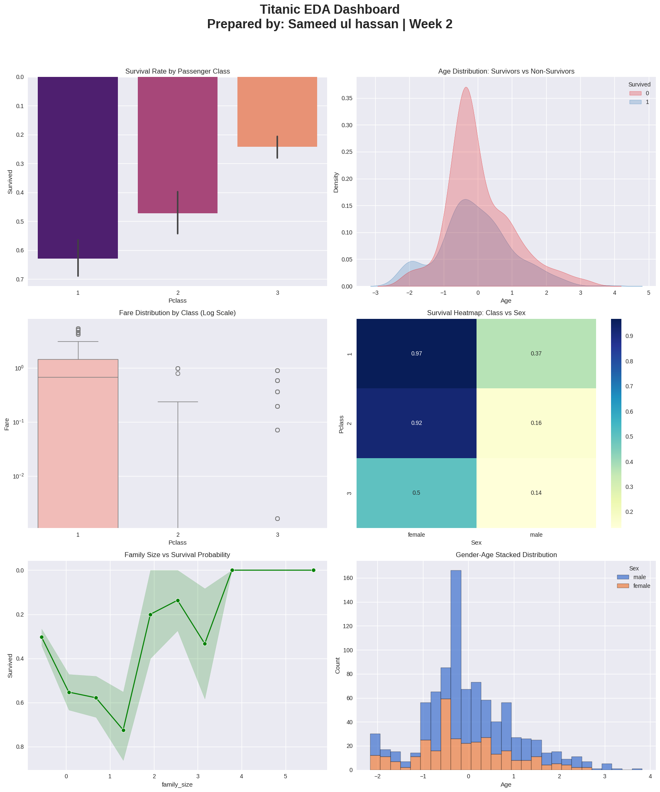

# 🚢 Titanic Survival Analysis — AI/ML Internship Week 2

> **AI/ML Internship Program · Week 2 of 8 · Data Analysis with NumPy & Pandas**

---

<div align="center">

**Submitted by: Sameed Ul Hassan**  
📅 Deadline: 3rd May 2026 &nbsp;|&nbsp; 🏫 Instructor: Zain Ul Abideen &nbsp;|&nbsp; 🐍 Python · NumPy · Pandas

</div>

---

## 📌 Dataset Information

| Field | Details |
|-------|---------|
| **Dataset** | Titanic — Machine Learning from Disaster |
| **Source** | [Kaggle Competition](https://www.kaggle.com/competitions/titanic/data) |
| **File** | `train.csv` |
| **Rows** | 891 passengers |
| **Columns** | 12 original → 22 after feature engineering |
| **Target** | `Survived` (0 = No, 1 = Yes) — Overall survival rate: **38.4%** |

---

## 🏆 Top 3 Survival Insights

### 1. 👩 Sex is the Single Strongest Predictor
Female passengers survived at **74.2%** vs only **18.9%** for males — a gap of **55.3 percentage points**. This directly reflects the *"women and children first"* maritime code actively enforced during the disaster. In the correlation matrix, sex had the highest absolute correlation with survival at **0.54**.

### 2. 🎩 Passenger Class Determines Life Chances
Socioeconomic status created a stark survival gradient:

| Class | Survival Rate | Avg. Fare |
|-------|-------------|-----------|
| 1st Class | **63.0%** | £84.15 |
| 2nd Class | **47.3%** | £20.66 |
| 3rd Class | **24.2%** | £13.68 |

Third-class passengers faced structural barriers to evacuation — their cabins were deep in the ship and lifeboat access was restricted.

### 3. 💷 Survivors Paid 2.2× More in Fares
Survivors paid a mean fare of **~£48.40** vs **~£22.12** for non-survivors. The interaction of `Pclass × Sex` tells the most extreme story: **1st-class females survived at 96.8%** while **3rd-class males survived at only 13.5%** — a difference of **83.3 percentage points**.

---

## 📊 Dashboard Screenshot



> *6-chart EDA dashboard: survival by class, age KDE distributions, fare box plots by class (log scale), Pclass × Sex heatmap, family size survival curve, and title-based stacked bar chart.*

---

## 🗂️ Repository Structure

```
AIML-Internship-Week2-SameedUlHassan/
│
├── AI_ML_week_2_Sameed_Ul_Hassan_.ipynb   # Main analysis notebook (16 steps)
├── titanic_cleaned.csv                     # Final ML-ready cleaned dataset
├── titanic_dashboard.png                   # 6-chart EDA dashboard
└── README.md                               # This file
```

---

## 🛠️ Tools & Libraries Used

| Library | Version | Purpose |
|---------|---------|---------|
| **Python** | 3.x | Core language |
| **NumPy** | 1.24+ | Array computing, broadcasting, linear algebra |
| **Pandas** | 2.0+ | Data loading, cleaning, groupby, merging |
| **Matplotlib** | 3.7+ | Base plotting framework |
| **Seaborn** | 0.12+ | Statistical visualizations, heatmaps, KDE |
| **Missingno** | 0.5+ | Missing data visualization |
| **Scikit-learn** | 1.3+ | StandardScaler for feature scaling |
| **Google Colab** | — | Execution environment |

---

## 📋 Analysis Pipeline (16 Steps)

**Part A — NumPy Deep Dive & Data Loading**
- Step 1: NumPy warm-up — broadcasting, boolean masking, dot products
- Step 2: Dataset loading and full initial inspection
- Step 3: Missing value deep analysis with missingno
- Step 4: Data type audit and corrections

**Part B — Data Cleaning & Feature Engineering**
- Step 5: Professional missing value handling (group-level median imputation)
- Step 6: Outlier detection via IQR & winsorization
- Step 7: 7 engineered features (family_size, is_alone, title, age_group, fare_bin, fare_per_person, deck)
- Step 8: Categorical encoding (label, one-hot, ordinal)
- Step 9: StandardScaler feature scaling → titanic_cleaned.csv

**Part C — Advanced GroupBy & Statistical Analysis**
- Step 10: Multi-factor survival analysis with bar charts
- Step 11: Advanced .agg() with custom functions + .transform()
- Step 12: Pivot table analysis with heatmaps
- Step 13: Full correlation matrix analysis

**Part D — Dashboard, NumPy Analysis & Report**
- Step 14: Pure NumPy performance analysis and survival computation
- Step 15: 6-chart professional EDA dashboard
- Step 16: 7-section written analysis report

---

## 🔍 Feature Selection for Week 5 (Logistic Regression)

Based on correlation analysis and domain knowledge, the recommended top 7 features are:

```python
features = ['sex_encoded', 'Pclass', 'fare_per_person',
            'title_Mr', 'age_group_encoded', 'is_alone', 'has_cabin']
target = 'Survived'
```

---

## 📚 Key Learnings

- ✅ NumPy broadcasting eliminates loops — normalized a 6×4 matrix with zero for-loops
- ✅ Group-level imputation is superior to global mean — preserves demographic variance
- ✅ Winsorization preserves outliers that carry real signal (first-class fares are legitimate)
- ✅ The Pclass × Sex interaction is multiplicative, not additive — critical for model design
- ✅ Feature engineering (title extraction, family_size, is_alone) added more signal than raw columns

---

<div align="center">

**Instructor:** Zain Ul Abideen · [LinkedIn](https://linkedin.com/in/zain-ul-abideen3) · [GitHub](https://github.com/zain-ul-abideen-5036)  
**Program:** AI/ML Internship · Week 2 of 8

</div>
```

---

One note: the screenshot line `` will only render on GitHub once you upload your `titanic_dashboard.png` image to the same repo folder. Everything else works immediately.
